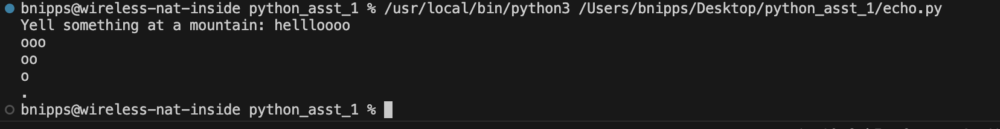
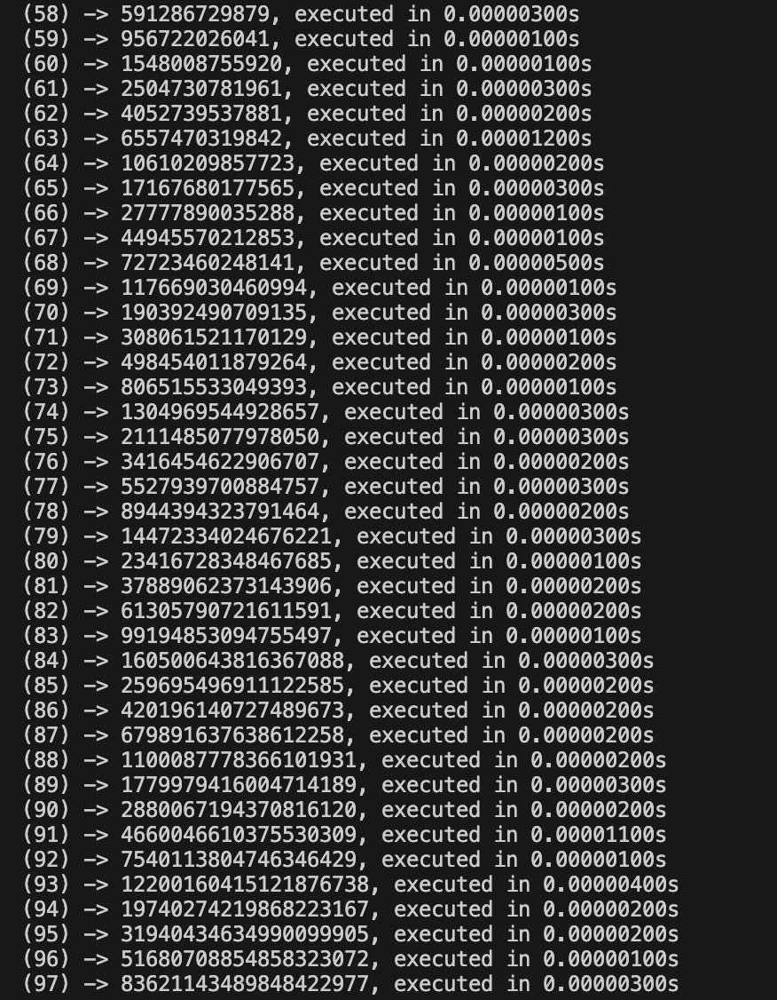
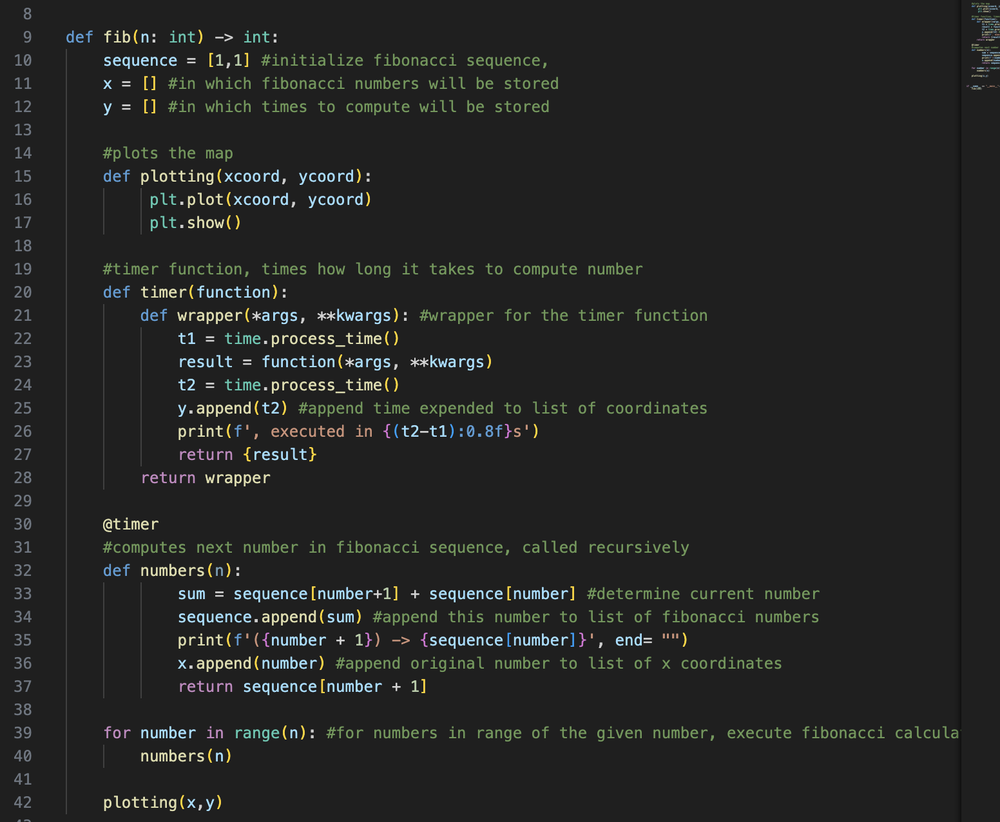

# PythonAssignment

In the code folder, there are two Python files.
echo.py produces an "echo" that returns the last 3 letters of an input string, then the last two, then the last one.

The second file, fib.py, calculates every number in the fibonacci sequence up to the 100th number, printing each one. It also uses a timer decorator function to determine the amount of time it takes to calculate each number.

Additionally, the code outputs a graph that shows the cumulative amount of time taken to calculate all numbers in the sequence.

The code works by having a main function call upon another function that has timer, calculation, and graphing functions inside it. First, the code calculates the number, while timing how long it takes. Then, the index of the fibonacci number and the total time are stored in a list, which is then used to create a graph.

